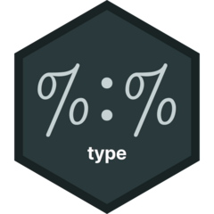

<!-- README.md is generated from README.Rmd. Please edit that file -->

# type 

<!-- badges: start -->

[](https://app.codecov.io/gh/EthanSansom/type)
[](https://github.com/EthanSansom/type/actions/workflows/R-CMD-check.yaml)
[](https://lifecycle.r-lib.org/articles/stages.html#experimental)
<!-- badges: end -->

{type} provides a lightweight type system for R, meant for users to
quickly and easily add run-time type validation to functions and
variables. The {type} package supports:

- Adding type annotations to function arguments and return values.
- Declaring typed variables and constants.
- Defining new types and type aliases.

## Installation

You can install the development version of {type} from
[GitHub](https://github.com/) with:

``` r
# install.packages("pak")
pak::pak("EthanSansom/type")
```

## Types

A “type” in {type} defines a set of restrictions used to validate other
objects in R. For example, the type `t_bool` (for “boolean type”)
requires that an object:

- Is a bare logical vector.
- Is scalar (size 1).
- Contains no `NA` values.

In other words, an object of type `t_bool` must be either `TRUE` or
`FALSE`.

When a type is printed, it displays the requirements that an object of
that type must meet:

``` r
print(t_bool)
#> <type>
#> • `<object>` is a bare <logical>.
#> • `<object>` is size 1.
#> • `<object>` contains no missing values.
```

`obj_is_type()` may be used to test whether an object meets the
requirements of a given type.

``` r
obj_is_type(10L, t_bool)
#> [1] FALSE
obj_is_type(TRUE, t_bool)
#> [1] TRUE
```

For additional information on why a type test failed or succeeded, use
`obj_inspect_type()` to print a diagnostic message.

``` r
obj_inspect_type(NA, t_bool)
#> Object `NA` does not have the expected type.
#> ✔ `NA` is a bare <logical>.
#> ✔ `NA` is size 1.
#> ℹ `NA` must not contain missing elements.
#> ✖ `NA` is NA at location `1`.
```

A variable may be restricted to a given type using the `%:%` operator:

``` r
# Require that `x` is an integer, and initialize `x` to `1:5`
t_int %:% x(1:5)
x 
#> [1] 1 2 3 4 5
```

Once a variable is typed, it may be re-assigned to a variable of the
same type, but cannot be assigned a different type:

``` r
x <- 2L
x
#> [1] 2

x <- "A"
#> Error:
#> ! Attempted to assign a mistyped value to `x`.
#> ✖ `<value>` must be a bare <integer>, not a bare <character>.
#> ℹ Run `last_type()` to get the expected type.
```

Alternatively, `obj_assert_type()` may be used to interactively enforce
the type of an object:

``` r
obj_assert_type(data.frame(x = 1:3), t_int)
#> Error in `obj_assert_type()`:
#> ! Object `data.frame(x = 1:3)` is mistyped.
#> ℹ `data.frame(x = 1:3)` must be a bare <integer>.
#> ✖ `data.frame(x = 1:3)` is a S3 object of class <data.frame>.
#> ℹ Run `last_type()` to get the expected type.
```

Both `%:%`, `obj_assert_type()`, and other type validation functions in
{type} raise {rlang} errors of class `<type_error_mistyped>` when an
object is mistyped.

### Base Types

{type} includes the following base types for common R objects:

| Object        | Matches                                    |
|---------------|--------------------------------------------|
| `t_any`       | Any object                                 |
| `t_null`      | `NULL`                                     |
| `t_list`      | A list                                     |
| `t_env`       | An environment                             |
| `t_fun`       | A function                                 |
| `t_vec`       | A {vctrs} style vector                     |
| `t_num`       | An numeric (e.g. integer or double) vector |
| `t_lgl`       | A bare logical vector                      |
| `t_bool`      | A single `TRUE` or `FALSE`                 |
| `t_int`       | A bare integer vector                      |
| `t_dbl`       | A bare double vector                       |
| `t_chr`       | A bare character vector                    |
| `t_string`    | A single non-`NA` string                   |
| `t_dataframe` | A data frame                               |
| `t_factor`    | A factor                                   |
| `t_date`      | A `Date`                                   |
| `t_posixct`   | A `POSIXct` datetime                       |

### Traits

Every type is built using traits, which add restrictions to a type. For
example, the base `t_string` type is built using the `sized()` and
`complete()` traits:

``` r
# A string is:
t_string <- t_chr |> # A character vector
  sized(1L) |>       # Of size 1
  complete()         # Which is non-missing
```

Traits compose naturally using the `|>` operator, making it easy to
define custom types.

``` r
t_probability <- t_dbl |> bounded(0, 1, "[]")

obj_inspect_type(0.5, t_probability)
#> Object `0.5` has the expected type.
#> ✔ `0.5` is a bare <double>.
#> ✔ `0.5` is bounded by [0, 1].
```

### Structural Types

{type} defines a small dialect for setting type constraints on parts of
an object using `on()` selector functions, `has()`, and
`has_relation()`:

``` r
# `names()` of an object must contain "x" and "y"
t_any |> has(on(names), t_chr |> contains(c("x", "y")))
#> <type>
#> • `names(<object>)` is a bare <character>.
#> • `names(<object>)` contains elements: `c("x", "y")`.

# Element `[[1]]` of an object must be a function
t_any |> has(on_elm(1L), t_fun)
#> <type>
#> • `<object>[[1]]` is a function.

# Every element of the object must be the same size
t_list |> has_relation(same_sized(on_each()))
#> <type>
#> • `<object>` is a bare <list>.
#> • Each element of `<object>` are the same size.
```

These are useful for building complex types from a simple set of traits.

``` r
t_coordinates <- t_list |>
  has(on(names), t_chr |> same_as(c("lat", "lon"))) |>
  has(on_elm("lat"), t_dbl |> bounded(-90, 90)) |>
  has(on_elm("lon"), t_dbl |> bounded(-180, 180)) |>
  has_relation(same_sized(on_elm("lat"), on_elm("lon")))
 
good <- list(lat = c(51.5, 40.7), lon = c(-0.1, -74.0))
bad <- list(lat = c(51.5, 200.0), lon = c(-0.1, -74.0, 0.0))
worst <- list(x = "A")
 
obj_is_type(good, t_coordinates)
#> [1] TRUE
obj_inspect_type(bad, t_coordinates)
#> Object `bad` does not have the expected type.
#> ✔ `bad` is a bare <list>.
#> ✔ `names(bad)` is a bare <character>.
#> ✔ `names(bad)` is the same as: `c("lat", "lon")`.
#> ℹ `bad[["lat"]]` must be bounded by [-90, 90].
#> ✖ `bad[["lat"]]` is out of bounds at location `2`.
obj_inspect_type(worst, t_coordinates)
#> Object `worst` does not have the expected type.
#> ✔ `worst` is a bare <list>.
#> ℹ `names(worst)` must be: `c("lat", "lon")`.
#> ✖ `names(worst)` is missing 2 elements: `c("lat", "lon")`.
#> ✖ `names(worst)` contains 1 unexpected element: `"x"`.
```

`list_type()` and `dataframe_type()` provide a shorthand for typed
containers:

``` r
t_survey <- dataframe_type(
  id = t_int |> complete(), 
  score = t_dbl |> bounded(0, 100)
)
print(t_survey)
#> <type>
#> • `<object>` inherits from class `data.frame`.
#> • `names(<object>)` is a bare <character>.
#> • `names(<object>)` is the same as: `c("id", "score")`.
#> • `<object>[["id"]]` is a bare <integer>.
#> • `<object>[["id"]]` contains no missing values.
#> • `<object>[["score"]]` is a bare <double>.
#> • `<object>[["score"]]` is bounded by [0, 100].
```

While `list_of_type()` constructs the common case of a homogenous list
type:

``` r
t_list_of_chr <- list_of_type(t_chr)

obj_is_type(list("A", "B", "C"), t_list_of_chr)
#> [1] TRUE
obj_is_type(list("A", 2L, "C"), t_list_of_chr)
#> [1] FALSE
```

### Constants

A variable may be declared a constant using the `const()` modifier, in
which case it’s value cannot be changed after assignment.

``` r
const(t_int) %:% z(1L)
z <- 2L
#> Error:
#> ! Can't assign to the constant `z`.
#> ℹ Run `last_type()` to get the expected type.
```

### Type Unions

Two or more types may be combined into a *type union*, which requires
that an object satisfy at least one of the types’ constraints.

``` r
t_rownames <- type_union(t_int, t_chr) |> complete()

obj_is_type(FALSE, t_rownames)
#> [1] FALSE
obj_is_type(1:3, t_rownames)
#> [1] TRUE
obj_is_type(c("a", "b", "c"), t_rownames)
#> [1] TRUE
```

Failed type union checks report the unmet requirement of each type in
the union:

``` r
obj_inspect_type(NA_integer_, t_rownames)
#> Object `NA_integer_` does not have the expected type.
#> • Type option 1 of 2:
#> ✔ `NA_integer_` is a bare <integer>.
#> ℹ `NA_integer_` must not contain missing elements.
#> ✖ `NA_integer_` is NA at location `1`.
#> • Type option 2 of 2:
#> ✖ `NA_integer_` must be a bare <character>, not a bare <integer>.
```

## Typed Functions

A typed function is declared using `typed()`.

``` r
str_remove <- typed(function(
  x = t_chr, 
  pattern = t_string, 
  fixed = t_bool %:% FALSE
) {
  base::gsub(x = x, pattern = pattern, replacement = "", fixed = fixed)
})
print(str_remove)
#> <typed>
#> function (x, pattern, fixed = FALSE) 
#> {
#>     base::gsub(x = x, pattern = pattern, replacement = "", fixed = fixed)
#> }
#> <environment: 0x120be0f18>
#> Arguments:
#> • `x` is a bare <character>.
#> • `pattern` is a bare <character>.
#> • `pattern` is size 1.
#> • `pattern` contains no missing values.
#> • `fixed` is a bare <logical>.
#> • `fixed` is size 1.
#> • `fixed` contains no missing values.
#> Returns:
#> • `<result>` is an R object.
```

Arguments without default values are annotated using a type
(e.g. `x = t_chr`) and default values are provided using the `%:%`
operator.

When called, a typed function validates each of its typed arguments,
raising an error if an argument is mistyped.

``` r
str_remove("hello", pattern = "he")
#> [1] "llo"
str_remove("goodbye", pattern = NA_character_)
#> Error in `str_remove()`:
#> ! Argument `pattern` is mistyped.
#> ℹ `pattern` must not contain missing elements.
#> ✖ `pattern` is NA at location `1`.
#> ℹ Run `last_type()` to get the expected type.
```

With `last_type()`, interactively debugging failed argument or object
type checks is simple.

``` r
# What type was expected?
t_expected <- last_type()
print(t_expected)
#> <type>
#> • `<object>` is a bare <character>.
#> • `<object>` is size 1.
#> • `<object>` contains no missing values.

# How does my input compare?
pattern <- NA_character_
obj_inspect_type(pattern, t_expected)
#> Object `pattern` does not have the expected type.
#> ✔ `pattern` is a bare <character>.
#> ✔ `pattern` is size 1.
#> ℹ `pattern` must not contain missing elements.
#> ✖ `pattern` is NA at location `1`.
```

The return type of a function may be specified using the `returns`
argument.

``` r
safe_any <- typed(
  function(... = t_lgl, na.rm = t_bool %:% FALSE) {
    base::any(..., na.rm = na.rm)
  },
  returns = t_lgl |> sized(1L)
)
print(safe_any)
#> <typed>
#> function (..., na.rm = FALSE) 
#> {
#>     base::any(..., na.rm = na.rm)
#> }
#> <environment: 0x120be0f18>
#> Arguments:
#> • Each element of `...` is a bare <logical>.
#> • `na.rm` is a bare <logical>.
#> • `na.rm` is size 1.
#> • `na.rm` contains no missing values.
#> Returns:
#> • `<result>` is a bare <logical>.
#> • `<result>` is size 1.
```

Additionally, any relation compatible with `has_relation()` may also be
used to define between-argument constraints. Here, we require that the
`x`, `start`, and `stop` arguments of `safe_substr()` are either
length-1 or the same length, using the `recyclable()` relation:

``` r
safe_substr <- typed(
  recyclable(x, start, stop),
  function(x = t_chr, start = t_int, stop = t_int) {
    base::substr(x, start, stop)
  },
  returns = t_chr
)

safe_substr(c("works", "fine"), 1L, 2L)
#> [1] "wo" "fi"
safe_substr(c("this", "wont", "work"), 1:2, 1:2)
#> Error in `safe_substr()`:
#> ! Arguments `x`, `start`, and `stop` must be recyclable.
#> ✖ `x` (size 3) and `start` (size 2) are incompatible sizes.
```

Type checks may be removed from any typed function using `untyped()`,
which is useful for bypassing argument validation in pre-validated or
performance sensitive areas of code.

``` r
untyped(safe_any)
#> function (..., na.rm = FALSE) 
#> {
#>     base::any(..., na.rm = na.rm)
#> }
#> <environment: 0x120be0f18>
```
